# Icon examples

Generated from the static React components with `npm run generate-png`. Do not edit this catalog or the PNGs by hand.

[Quick start](../README.md) · [Usage reference](../docs/usage.md) · [Generation setup](../docs/development.md#generate-icon-examples)

Animation groups are excluded because PNGs are static snapshots. Names below are `createTheme` keys.

| Icon | Theme key |
| --- | --- |
| 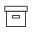 | `archive` |
| 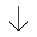 | `arrowDown` |
| 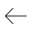 | `arrowLeft` |
| 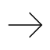 | `arrowRight` |
| 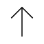 | `arrowUp` |
| 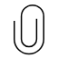 | `attachment` |
| 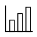 | `barChart` |
|  | `book` |
| 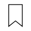 | `bookmark` |
|  | `calendar` |
|  | `camera` |
|  | `cancel` |
| 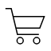 | `cart` |
|  | `chat` |
|  | `check` |
|  | `checkCircle` |
|  | `chevronDown` |
|  | `chevronLeft` |
|  | `chevronRight` |
|  | `chevronUp` |
|  | `clipboard` |
| 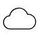 | `cloud` |
| 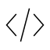 | `code` |
| 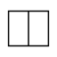 | `columns` |
|  | `copy` |
| 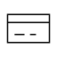 | `creditCard` |
|  | `dash` |
| 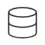 | `database` |
|  | `dotsHorizontal` |
|  | `dotsVertical` |
|  | `download` |
| 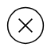 | `error` |
| 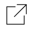 | `externalLink` |
| 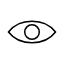 | `eye` |
| 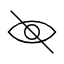 | `eyeOff` |
| 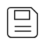 | `file` |
|  | `filter` |
|  | `folder` |
|  | `globe` |
| 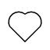 | `heart` |
| 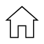 | `home` |
| 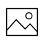 | `image` |
| 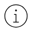 | `info` |
| 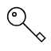 | `key` |
|  | `lightBulb` |
| 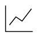 | `lineChart` |
| 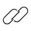 | `link` |
| 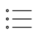 | `list` |
|  | `lock` |
| 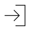 | `login` |
| 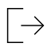 | `logout` |
|  | `mail` |
| 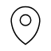 | `mapPin` |
|  | `menu` |
| 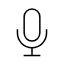 | `microphone` |
|  | `notifications` |
| 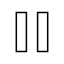 | `pause` |
|  | `pen` |
| 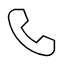 | `phone` |
| 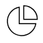 | `pieChart` |
| 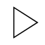 | `play` |
|  | `plus` |
| 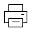 | `printer` |
|  | `questionMark` |
| 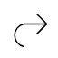 | `redo` |
| 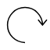 | `refresh` |
|  | `remove` |
|  | `ruler` |
| 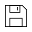 | `save` |
|  | `search` |
|  | `settings` |
| 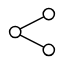 | `share` |
| 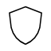 | `shield` |
|  | `shrug` |
|  | `spinner` |
|  | `star` |
| 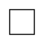 | `stop` |
|  | `stopwatch` |
|  | `submit` |
| 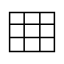 | `table` |
| 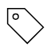 | `tag` |
| 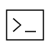 | `terminal` |
|  | `trash` |
| 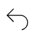 | `undo` |
| 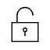 | `unlock` |
| 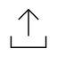 | `upload` |
|  | `user` |
| 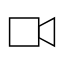 | `video` |
| 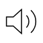 | `volume` |
|  | `volumeOff` |
|  | `warning` |
|  | `wifi` |
