| Icon | Name |
| --- | --- |
| 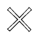 | cancel |
| 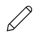 | pen |
| 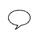 | chat |
| 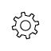 | settings |
| 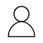 | user |
|  | book |
|  | calendar |
| 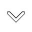 | chevronDown |
| 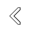 | chevronLeft |
| 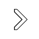 | chevronRight |
| 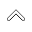 | chevronUp |
| 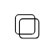 | copy |
| 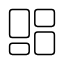 | dash |
| 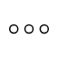 | dotsHorizontal |
| 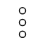 | dotsVertical |
| 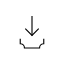 | download |
| 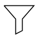 | filter |
| 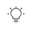 | lightBulb |
| 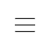 | menu |
| 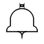 | notifications |
| 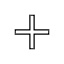 | plus |
| 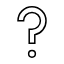 | questionMark |
| 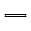 | remove |
| 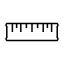 | ruler |
| 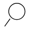 | search |
| 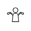 | shrug |
| 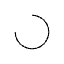 | spinner |
| 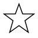 | star |
| 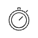 | stopwatch |
| 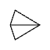 | submit |
| 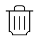 | trash |